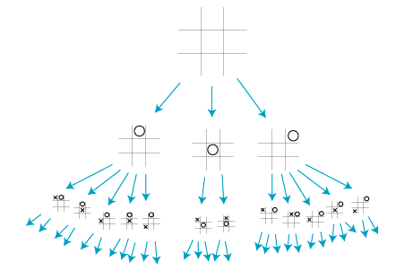
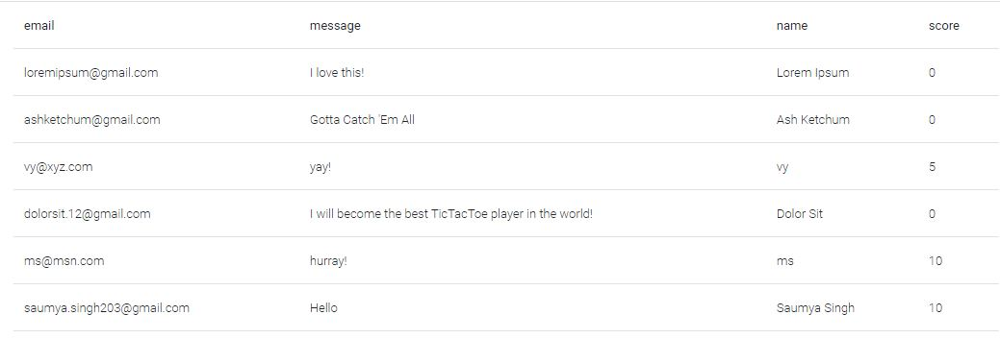

MICROSOFT Codess Project : Team-ROCKET 
--------------------------------------

TABLE OF CONTENTS
---------------
* Introduction
* Product Description
* Technologies
* Setup, Installation and Launch 
* User Journey
* Support <br>
 
INTRODUCTION
-------------
Tic-tac-toe (also known as noughts and crosses, three in a row, or Xs and Os) is a game for two players wherein each player takes turns marking the spaces, conventionally, in a 3x3 grid. The player that succeeds in placing three of their marks in either a horizontal, vertical, or diagonal row wins the game. <br>
<br>
The above GIF shows a sample game of Tic-Tac-Toe

PRODUCT DESCRIPTION
--------------------
Background
-----------
Microsoft’s Engage 2020 Mentorship Program aimed at equipping the students selected as mentees with the most up to date information in the field of Artificial Intelligence after having built a foundation for the same. The project undertaken by Team Rocket, a web-based application, has been designed to be an entertainment tool to be used by the crew of the Mars Colonization Project. The goal was to design a game of tic-tac-toe that utilised the concepts and principles of artificial intelligence with an original feature(s) or unique aspect(s) that set the project apart from that of others. 
The game has been developed to be played by a single player (the user) against the Team Rocket AI. The application contains varying levels of depths for the player to choose from (with _**level 1**_ being the easiest for the player to beat as opposed to the _**maximum**_ depth where the computer is undefeatable) that helps showcase the capabilities of the AI. <br> 

Algorithm Used
----------------
The application makes use of the **MINIMAX** algorithm– it is an algorithm that is conventionally used for games that are played on a turn by turn basis, such as tic-tac-toe, chess, backgammon, etc. The backtracking algorithm, used in game theory and decision making, minimises the player’s losses and maximises his wins.  It considers the present state of the game and the moves available, then for each valid move it plays  (alternating between min and max) until it finds a terminal state (win, draw or lose).
<br>
The above image displays a partial game tree for Tic-Tac-Toe. Credits to Professor Eppstein of UC Irvine.

TECHNOLOGIES
-------------
The project has been created with the use of:
* HTML
* CSS
* JavaScript
* Python
* jQuery
* MongoDB
 
LAUNCH
-------
Visit (insert link!!!!!) to access the deployed game.

Setup and Installation
------------------------
In order for the user to set up the game on their local machine, they are required to have Python3.5 (or a newer version) and a few dependencies installed. To set up the application, they are required to follow the following steps:
1. Clone the repository
2. Open the terminal window and execute the following command to install flask– a Python micro web framework that we have used on the backend.<br>
 ```pip install flask```
3. Execute the following command to move into the 'address' directory.<br>
 ```cd address```
4. Execute the following commands to install pymongo and dnspython– doing so will help you access the "leaderboard" database and consecutively view the leaderboard upon running the application on your local machine. <br>
 ```pip install pymongo```<br>
 ```pip install dnspython```
5. Run the following command to launch the flask application.<br>
 ```python ttt_integrated.py```
6. After executing the previous command, the following will be displayed:
<br>
This means that the website is successfully running on the local machine. Copy and pasting the link into the search bar of your browser will help you launch the web application on your local machine.
 
Viewing the database page
---------------------------
Upon successfully running the website on your local machine, typing the following into the search bar of your browser will display the database page. <br>
```localhost:5000/database```<br>
This will allow the user to view the comments left behind by the visitors along with their scores. The data stored in the database is then displayed as follows:<br>


USER JOURNEY
---------------
The GIF given below will help the user navigate through the web application with ease.

A visual guide to help show the user how to navigate through the application.

In the previous demonstration, we see that a player playing at depth 1 has a greater chance of winning the game, the instance given below shows that such is not to be the case when playing at the maximum depth.

SUPPORT
---------
For any queries or problems that may arise with regards to the project, the authors can be contacted at codessteamrocket@gmail.com
